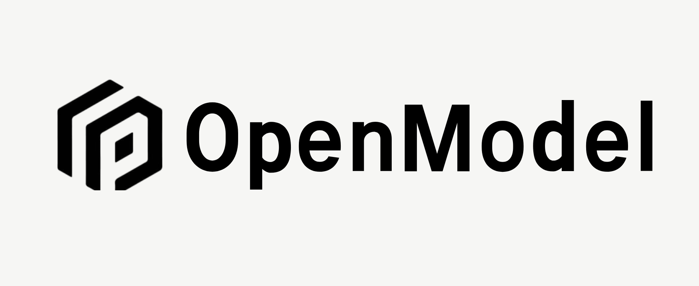
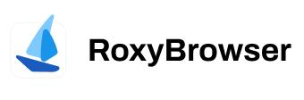

# Sub2API

<div align="center">

[](https://golang.org/)
[](https://vuejs.org/)
[](https://www.postgresql.org/)
[](https://redis.io/)
[](https://www.docker.com/)

<a href="https://trendshift.io/repositories/21823" target="_blank"></a>

**サブスクリプションクォータ配分のための AI API ゲートウェイプラットフォーム**

[English](README.md) | 日本語

</div>

## ⚠️ 重要なお知らせ

本プロジェクトをご利用になる前に、以下の内容を必ずよくお読みください：

- **🚨 利用規約のリスク**：本プロジェクトの使用は、Anthropic をはじめとする上流プロバイダーの利用規約に違反する可能性があります。ご利用前に各プロバイダーのユーザー規約を必ずご確認ください。使用により生じるすべてのリスクはユーザーご自身が負うものとします。
- **⚖️ 法令遵守**：お住まいの国または地域の法令を遵守した上で本プロジェクトをご利用ください。いかなる違法な目的での使用も固く禁じます。
- **📖 免責事項**：本プロジェクトは技術的な学習および研究の目的でのみ提供されます。本プロジェクトの使用により生じたアカウントの停止、サービスの中断、データの損失、その他一切の直接的または間接的な損害について、作者は一切の責任を負いません。

## 概要

Sub2API は、AI 製品のサブスクリプションから API クォータを配分・管理するために設計された AI API ゲートウェイプラットフォームです。ユーザーはプラットフォームが生成した API キーを通じて上流の AI サービスにアクセスでき、プラットフォームは認証、課金、負荷分散、リクエスト転送を処理します。

## 機能

- **マルチアカウント管理** - 複数の上流アカウントタイプ（OAuth、APIキー）をサポート
- **APIキー配布** - ユーザー向けの APIキーの生成と管理
- **精密な課金** - トークンレベルの使用量追跡とコスト計算
- **スマートスケジューリング** - スティッキーセッション付きのインテリジェントなアカウント選択
- **同時実行制御** - ユーザーごと・アカウントごとの同時実行数制限
- **レート制限** - 設定可能なリクエスト数およびトークンレート制限
- **内蔵決済システム** - EasyPay、Alipay、WeChat Pay、Stripe に対応。ユーザーのセルフサービスチャージが可能で、別途決済サービスのデプロイは不要（[設定ガイド](docs/PAYMENT.md)）
- **管理ダッシュボード** - 監視・管理のための Web インターフェース
- **外部システム連携** - 外部システム（チケット管理など）を iframe 経由で管理ダッシュボードに埋め込み可能

## ❤️ スポンサー

> [こちらに掲載しませんか？](mailto:support@pincc.ai)

<table>

<tr>
<td width="180"><a href="https://www.openmodel.ai?ref=sub2api"></a></td>
<td>1つの API で、トップモデルを使い放題！<a href="https://www.openmodel.ai?ref=sub2api">OpenModel</a> は本番環境グレードで高可用性の AI API ゲートウェイに特化し、アプリを真に高速・安定させます：自動フェイルオーバー、最適なチャネルへのスマートルーティング、本番グレードの SLA 保証。単一プロバイダーをはるかに上回る SLA で、安定性をあなたの核心的な競争力にします。</td>
</tr>

<tr>
<td width="180"><a href="https://etok.ai"></a></td>
<td>ETok.ai のご支援に感謝します！ETok.ai はワンストップ AI プログラミングツールサービスプラットフォームの構築に取り組んでいます。Claude Code の専用プランと技術コミュニティサービスを提供し、Google Gemini や OpenAI Codex もサポートしています。丁寧に設計されたプランと専門的な技術コミュニティを通じて、開発者に安定したサービス保証と継続的な技術サポートを提供し、AI アシスト プログラミングを真の生産性向上ツールにします。<a href="https://etok.ai">こちら</a>から登録！</td>
</tr>

<tr>
<td width="180"><a href="https://aigocode.com/invite/SUB2API"></a></td>
<td>AIGoCode のご支援に感謝します！AIGoCode は Claude Code、Codex、最新の Gemini モデルを統合したオールインワンプラットフォームで、安定的かつ効率的でコストパフォーマンスに優れた AI コーディングサービスを提供します。柔軟なサブスクリプションプラン、アカウント停止リスクゼロ、VPN 不要の直接アクセス、超高速レスポンスが特長です。AIGoCode は sub2api ユーザー向けに特別特典を用意しています：<a href="https://aigocode.com/invite/SUB2API">こちらのリンク</a>から登録すると、初回チャージ時に 10% のボーナスクレジットを追加プレゼント！</td>
</tr>

<tr>
<td width="180"><a href="https://code.silkapi.com/register?aff=SUB2API"></a></td>
<td>SilkAPI のご支援に感謝します！<a href="https://code.silkapi.com/register?aff=SUB2API">SilkAPI</a> は Sub2API をベースに構築された中継サービスで、高速かつ安定した Codex API 中継の提供に特化しています。</td>
</tr>

<tr>
<td width="180"><a href="https://www.aicodemirror.com/register?invitecode=KMVZQM"></a></td>
<td>AICodeMirror のご支援に感謝します！AICodeMirror は Claude Code / Codex / Gemini CLI の公式高安定性リレーサービスを提供しており、エンタープライズグレードの同時実行、迅速な請求書発行、24時間年中無休の専属テクニカルサポートを備えています。Claude Code / Codex / Gemini の公式チャネルを定価の 38% / 2% / 9% で利用可能、チャージ時にはさらに追加割引！AICodeMirror は sub2api ユーザー向けに特別特典を提供中：<a href="https://www.aicodemirror.com/register?invitecode=KMVZQM">こちらのリンク</a>から登録すると、初回チャージが 20% オフ、法人のお客様は最大 25% オフ！</td>
</tr>

<tr>
<td width="180"><a href="https://shop.bmoplus.com/?utm_source=github"></a></td>
<td>本プロジェクトにご支援いただいた BmoPlus に感謝いたします！BmoPlusは、AIサブスクリプションのヘビーユーザー向けに特化した信頼性の高いAIアカウントサービスプロバイダーであり、安定した ChatGPT Plus / ChatGPT Pro (完全保証) / Claude Pro / Super Grok / Gemini Pro の公式代行チャージおよび即納アカウントを提供しています。こちらの<a href="https://shop.bmoplus.com/?utm_source=github">BmoPlus AIアカウント専門店/代行チャージ</a>経由でご登録・ご注文いただいたユーザー様は、GPTを 公式サイト価格の約1割（90% OFF） という驚異的な価格でご利用いただけます！</td>
</tr>

<tr>
<td width="180"><a href="https://bestproxy.com/?keyword=a2e8iuol"></a></td>
<td>Bestproxy のご支援に感謝します！<a href="https://bestproxy.com/?keyword=a2e8iuol">Bestproxy</a> は高純度の住宅IPを提供し、1アカウント1IP専有をサポートしています。実際の家庭ネットワークとフィンガープリント分離を組み合わせることで、リンク環境の分離を実現し、関連付けによるリスク管理の確率を低減します。</td>
</tr>

<tr>
<td width="180"><a href="https://pateway.ai/?ch=1tsfr51"></a></td>
<td>PatewayAI のご支援に感謝します！PatewayAI は、ヘビーAI開発者向けに公式直結を重視した高品質モデルAPIリレーサービスプロバイダーです。Claude 全シリーズおよび Codex シリーズモデルを提供し、100%公式ソースから直接供給 — 偽りなし、水増しなし、検証歓迎。課金は完全透明で、トークン単位の請求書を1件ずつ監査可能です。
エンタープライズ級の高同時接続にも対応し、法人顧客向けに専用管理プラットフォームを提供しています。法人顧客は正式な契約を締結し、請求書の発行が可能です。詳細は公式サイトでお問い合わせください。
<a href="https://pateway.ai/?ch=1tsfr51">こちらのリンク</a>から登録すると、$3 のトライアルクレジットがもらえます。チャージは最大40%オフ、友達紹介で双方にボーナス付与 — 紹介報酬は最大 $150。</td>
</tr>

<tr>
<td width="180"><a href="https://api.pptoken.org/register?promo=SUB2API"></a></td>
<td>PPToken.org のご支援に感謝します！<a href="https://api.pptoken.org/register?promo=SUB2API">PPToken.org</a> は GPT シリーズモデルの API 中継サービスを専門としており、Codex、Claude Code、OpenAI 互換クライアント、Gemini CLI などのツール接続をサポートしています。チャージは 1:1（1元＝1ドル分のクレジット）、GPT モデルは最低 0.16 倍のレート倍率で、総合コストは公式価格の約 2.2% 、最速ファーストトークンは約1秒 — 開発者が低コスト・高速レスポンスで GPT モデル機能にアクセスするのに最適です。テクニカルサポート：24時間365日リアルな人間が対応（ボットではありません）、グループ内で @技術 すれば 10 分以内に返信。スポンサー特典：先着 200 名のユーザーが<a href="https://api.pptoken.org/register?promo=SUB2API">専用登録リンク</a>から登録し、プロモコード `SUB2API` を入力すると、Codex / Claude Code の無料トライアルクレジットを獲得できます — 最低利用額なし、カード登録不要。
</td>
</tr>

<tr>
<td width="180"><a href="https://runapi.co/register?aff=fu2E"></a></td>
<td>RunAPI のご支援に感謝します！<a href="https://runapi.co/register?aff=fu2E">RunAPI</a> は効率的で安定した API プラットフォームで、OpenRouter の代替として利用できます。1つの API キーで OpenAI、Claude、Gemini、DeepSeek、Grok など 150以上の主要モデルにアクセスでき、価格は最低 10% から。非常に安定しており、Claude Code や OpenClaw などのツールとシームレスに互換します。
</td>
</tr>

<tr>
<td width="180"><a href="https://unity2.ai/register?source=sub2api"></a></td>
<td>Unity2 のご支援に感謝します！<a href="https://unity2.ai/register?source=sub2api">Unity2</a> は個人開発者、チーム、企業向けの高性能 AI モデル API 中継プラットフォームです。中国の大手企業に長期にわたりサービスを提供しており、1日あたり 300 億以上のトークン呼び出しを処理し、5000 RPM 級の高並列性をサポートします。1つの API キーで Claude Code、Codex、OpenAI モデル、IDE プラグイン、Agent ワークフローなど様々なシナリオに対応できます。エンタープライズグレードの安定供給能力を備え、高並列・継続的な呼び出し・チームの集中購入シーンでも低レイテンシと高可用性を維持します。残高課金、組み合わせサブスクリプション、初回チャージ特典、企業向け請求書発行、専属 1v1 サポートにも対応しており、個人の頻繁な利用にも企業の長期導入にも適しています。今 Unity2.ai に登録すると $2 の残高、公式グループに参加するとさらに $10 の残高がもらえ、合計最大 $12 の無料クレジットを獲得できます — 試用後に長期利用したい方に最適です。<a href="https://unity2.ai/register?source=sub2api">登録リンク</a>
</td>
</tr>

<tr>
<td width="180"><a href="https://veilx.io/#/hello/SJRBRVDV"></a></td>
<td>Veilx のご支援に感謝します！<a href="https://veilx.io/#/hello/SJRBRVDV">Veilx</a> CDN は超大規模 API リクエストシナリオ向けに設計されており、AI 中継サービスと AI API 呼び出しチェーンに対して深く最適化されています。高並列・高頻度リクエスト・大容量トラフィックに容易に対応し、開発者と企業により高速で安定した、低レイテンシの加速体験を提供します。OpenAI、Claude、Gemini などの AI インターフェース中継はもちろん、チャット、画像生成、Embedding、ストリーミング出力などの複雑なシナリオでも、Veilx は応答速度と接続安定性を大幅に向上させ、ネットワーク変動によるタイムアウトや失敗を効果的に削減します。さらに、Veilx は中国三大ネットワーク最適化の高速回線を提供しており、中国本土から海外 AI サービスへのアクセス速度と安定性を大幅に向上させます。グローバル AI 中継プラットフォーム、海外 AI SaaS、越境ビジネス、高並列 API システム展開に特に適しています。AI API のために生まれ、あなたの AI 中継サービスをより速く、より安定して、より安心に。<a href="https://veilx.io/#/hello/SJRBRVDV">購入リンク</a>
</td>
</tr>

<tr>
<td width="180"><a href="https://roxybrowser.com/invite/bgGKG7"></a></td>
<td>RoxyBrowser のご支援に感謝します！<a href="https://roxybrowser.com/invite/bgGKG7">RoxyBrowser</a> は Sub2API の理想的なパートナーです：ネイティブ統合された Roxy AI Agent と高品質なネイティブ住宅 IP を搭載し、シンプルなコマンドで一括自動化をサポート、マルチアカウント管理のセキュリティと効率を大幅に向上させます！<a href="https://roxybrowser.com/invite/bgGKG7">このリンク</a>から登録すると、無料の住宅 IP パッケージと生涯 10% 割引を獲得できます。
</td>
</tr>

<tr>
<td width="180"><a href="https://apikl.com"></a></td>
<td>Apikl のご支援に感謝します！Sub2API をベースに構築された本プラットフォームは、開発者向けに Codex / Claude シリーズモデルの中継サービスを提供しています。長期安定性、高速直結、高いコストパフォーマンスを重視し、従量課金の残高ベース課金、エンタープライズグレードの正規請求書、1対1の専属サポートを提供します。<a href="https://apikl.com">今すぐ登録</a>でチャージ 1:1 ボーナス — 残高が倍に！
</td>
</tr>

<tr>
<td width="180"><a href="https://tokeneum.ai"></a></td>
<td>TokenEum のご支援に感謝します！<a href="https://tokeneum.ai">TokenEum</a> は総合的な AI モデル集約プラットフォームおよびインテリジェントエージェント開発企業です。Claude、Gemini、OpenAI などの世界トップクラスのモデルに加え、GLM、Qwen、Kimi などの主要なオープンソースモデルも集約しており、品質と価格の異なる豊富な選択肢を提供してあらゆるニーズに対応します。また、Seedance2.0 や Happy Horse などの最先端の動画生成モデルも利用可能です。TokenEum は透明性と誠実なビジネスを重視し、すべてのモデル情報の正確性と信頼性を保証します。<a href="https://tokeneum.ai">tokeneum.ai</a> でぜひお試しください。
</td>
</tr>

<tr>
<td width="180"><a href="https://sub.666api.ai"></a></td>
<td>666api のご支援に感謝します！<a href="https://sub.666api.ai">sub.666api.ai</a> はオールインワンプラットフォームで、以下を提供しています：⚡ API 中継 — グローバルモデルへの従量課金アクセス、100% 公式ソースから直接供給、公式価格の最大 75% オフ。独占特典：Zhipu GLM 50% オフ・DeepSeek V4-pro 50% オフ・Seedance2.0 8% オフ（ホワイトリスト）・HappyHorse Overseas 30% オフ（ホワイトリスト）🔑 GPT サブスクリプションアカウント — 同源 IP 込み・グローバル住宅 IP 💰 請求書発行対応
</td>
</tr>

</table>

## エコシステム

Sub2API を拡張・統合するコミュニティプロジェクト:

| プロジェクト | 説明 | 機能 |
|---------|-------------|----------|
| ~~[Sub2ApiPay](https://github.com/touwaeriol/sub2apipay)~~ | ~~セルフサービス決済システム~~ | **内蔵済み** — 決済機能は Sub2API に統合されました。別途デプロイは不要です。[決済設定ガイド](docs/PAYMENT.md)をご参照ください |
| [sub2api-mobile](https://github.com/ckken/sub2api-mobile) | モバイル管理コンソール | ユーザー管理、アカウント管理、監視ダッシュボード、マルチバックエンド切り替えが可能なクロスプラットフォームアプリ（iOS/Android/Web）。Expo + React Native で構築 |

## 技術スタック

| コンポーネント | 技術 |
|-----------|------------|
| バックエンド | Go 1.25.7, Gin, Ent |
| フロントエンド | Vue 3.4+, Vite 5+, TailwindCSS |
| データベース | PostgreSQL 15+ |
| キャッシュ/キュー | Redis 7+ |

---

## Nginx リバースプロキシに関する注意

Sub2API（または CRS）を Nginx でリバースプロキシし、Codex CLI と組み合わせて使用する場合、Nginx の `http` ブロックに以下の設定を追加してください:

```nginx
underscores_in_headers on;
```

Nginx はデフォルトでアンダースコアを含むヘッダー（例: `session_id`）を破棄するため、マルチアカウント構成でのスティッキーセッションルーティングに支障をきたします。

---

## デプロイ

イメージは GHCR に公開されています:

- **バックエンド**（管理フロントエンドを内蔵）: `ghcr.io/wei-shaw/sub2api`
- **ユーザーポータル**: `ghcr.io/wei-shaw/sub2api-user-portal`

> **注意:** PostgreSQL と Redis は**外部サービス**です。本プロジェクトの compose ファイルには含まれないため、別途用意してください。

### Docker Compose（推奨）

#### 前提条件

- Docker 20.10+
- Docker Compose v2+
- PostgreSQL 15+（外部）
- Redis 7+（外部）

#### クイックスタート

```bash
cd deploy
cp .env.example .env        # 外部 DB/Redis 接続、JWT シークレット等を編集
cp config.example.yaml config.yaml
docker compose up -d
```

**セキュアなシークレットの生成方法:**
```bash
# JWT_SECRET を生成
openssl rand -hex 32

# TOTP_ENCRYPTION_KEY を生成
openssl rand -hex 32
```

#### よく使うコマンド

```bash
# ログを表示
docker compose logs -f sub2api

# ステータスを確認
docker compose ps

# 最新イメージをプルして再起動
docker compose pull && docker compose up -d

# サービスを停止
docker compose down
```

#### アクセス

ブラウザで `http://YOUR_SERVER_IP:8080` を開いてください。`ADMIN_PASSWORD` を設定しなかった場合は、ログで自動生成されたパスワードを確認できます:

```bash
docker compose logs sub2api | grep "admin password"
```

---

### ソースからビルド

開発やカスタマイズのためにソースコードからビルドして実行します。

#### 前提条件

- Go 1.21+
- Node.js 18+
- PostgreSQL 15+
- Redis 7+

#### ビルド手順

```bash
# 1. リポジトリをクローン
git clone https://github.com/Wei-Shaw/sub2api.git
cd sub2api

# 2. pnpm をインストール（未インストールの場合）
npm install -g pnpm

# 3. フロントエンドをビルド
cd frontend
pnpm install
pnpm run build
# 出力先: ../backend/internal/web/dist/

# 4. フロントエンドを組み込んだバックエンドをビルド
cd ../backend
go build -tags embed -o sub2api ./cmd/server

# 5. 設定ファイルを作成
cp ../deploy/config.example.yaml ./config.yaml

# 6. 設定を編集
nano config.yaml
```

> **注意:** `-tags embed` フラグはフロントエンドをバイナリに組み込みます。このフラグがない場合、バイナリはフロントエンド UI を提供しません。

**`config.yaml` の主要設定:**

```yaml
server:
  host: "0.0.0.0"
  port: 8080
  mode: "release"

database:
  host: "localhost"
  port: 5432
  user: "postgres"
  password: "your_password"
  dbname: "sub2api"

redis:
  host: "localhost"
  port: 6379
  password: ""

jwt:
  secret: "change-this-to-a-secure-random-string"
  expire_hour: 24

default:
  user_concurrency: 5
  user_balance: 0
  api_key_prefix: "sk-"
  rate_multiplier: 1.0
```

### Sora ステータス（一時的に利用不可）

> ⚠️ Sora 関連の機能は、上流統合およびメディア配信の技術的問題により一時的に利用できません。
> 現時点では本番環境で Sora に依存しないでください。
> 既存の `gateway.sora_*` 設定キーは予約されていますが、これらの問題が解決されるまで有効にならない場合があります。

`config.yaml` では追加のセキュリティ関連オプションも利用できます:

- `cors.allowed_origins` - CORS 許可リスト
- `security.url_allowlist` - 上流/価格/CRS ホストの許可リスト
- `security.url_allowlist.enabled` - URL バリデーションの無効化（注意して使用）
- `security.url_allowlist.allow_insecure_http` - バリデーション無効時に HTTP URL を許可
- `security.url_allowlist.allow_private_hosts` - プライベート/ローカル IP アドレスを許可
- `security.response_headers.enabled` - 設定可能なレスポンスヘッダーフィルタリングを有効化（無効時はデフォルトの許可リストを使用）
- `security.csp` - Content-Security-Policy ヘッダーの制御
- `billing.circuit_breaker` - 課金エラー時にフェイルクローズ
- `server.trusted_proxies` - X-Forwarded-For パースの有効化
- `turnstile.required` - リリースモードでの Turnstile 必須化

**⚠️ セキュリティ警告: HTTP URL 設定**

`security.url_allowlist.enabled=false` の場合、システムはデフォルトで最小限の URL バリデーションを行い、**HTTP URL を拒否**して HTTPS のみを許可します。HTTP URL を許可するには（開発環境や内部テスト用など）、以下を明示的に設定する必要があります:

```yaml
security:
  url_allowlist:
    enabled: false                # 許可リストチェックを無効化
    allow_insecure_http: true     # HTTP URL を許可（⚠️ セキュリティリスクあり）
```

**または環境変数で設定:**

```bash
SECURITY_URL_ALLOWLIST_ENABLED=false
SECURITY_URL_ALLOWLIST_ALLOW_INSECURE_HTTP=true
```

**HTTP を許可するリスク:**
- API キーとデータが**平文**で送信される（傍受の危険性）
- **中間者攻撃（MITM）**を受けやすい
- **本番環境には不適切**

**HTTP を使用すべき場面:**
- ✅ ローカルサーバーでの開発・テスト（http://localhost）
- ✅ 信頼できるエンドポイントを持つ内部ネットワーク
- ✅ HTTPS 取得前のアカウント接続テスト
- ❌ 本番環境（HTTPS のみを使用）

**この設定なしで表示されるエラー例:**
```
Invalid base URL: invalid url scheme: http
```

URL バリデーションまたはレスポンスヘッダーフィルタリングを無効にする場合は、ネットワーク層を強化してください:
- 上流ドメイン/IP のエグレス許可リストを適用
- プライベート/ループバック/リンクローカル範囲をブロック
- TLS のみのアウトバウンドトラフィックを強制
- プロキシで機密性の高い上流レスポンスヘッダーを除去

```bash
# 6. アプリケーションを実行
./sub2api
```

#### 開発モード

```bash
# バックエンド（ホットリロード付き）
cd backend
go run ./cmd/server

# フロントエンド（ホットリロード付き）
cd frontend
pnpm run dev
```

#### コード生成

`backend/ent/schema` を編集した場合、Ent + Wire を再生成してください:

```bash
cd backend
go generate ./ent
go generate ./cmd/server
```

---

## シンプルモード

シンプルモードは、フル SaaS 機能を必要とせず、素早くアクセスしたい個人開発者や社内チーム向けに設計されています。

- 有効化: 環境変数 `RUN_MODE=simple` を設定
- 違い: SaaS 関連機能を非表示にし、課金プロセスをスキップ
- セキュリティに関する注意: 本番環境では `SIMPLE_MODE_CONFIRM=true` も設定する必要があります

---

## Antigravity サポート

Sub2API は [Antigravity](https://antigravity.so/) アカウントをサポートしています。認証後、Claude および Gemini モデル用の専用エンドポイントが利用可能になります。

### 専用エンドポイント

| エンドポイント | モデル |
|----------|-------|
| `/antigravity/v1/messages` | Claude モデル |
| `/antigravity/v1beta/` | Gemini モデル |

### Claude Code の設定

```bash
export ANTHROPIC_BASE_URL="http://localhost:8080/antigravity"
export ANTHROPIC_AUTH_TOKEN="sk-xxx"
```

### ハイブリッドスケジューリングモード

Antigravity アカウントはオプションの**ハイブリッドスケジューリング**をサポートしています。有効にすると、汎用エンドポイント `/v1/messages` および `/v1beta/` も Antigravity アカウントにリクエストをルーティングします。

> **⚠️ 警告**: Anthropic Claude と Antigravity Claude は**同じ会話コンテキスト内で混在させることはできません**。グループを使用して適切に分離してください。

### 既知の問題

Claude Code では、Plan Mode を自動的に終了できません。（通常、ネイティブの Claude API を使用する場合、計画が完了すると Claude Code はユーザーに計画を承認または拒否するオプションをポップアップ表示します。）

**回避策**: `Shift + Tab` を押して手動で Plan Mode を終了し、計画を承認または拒否するためのレスポンスを入力してください。

---

## プロジェクト構成

```
sub2api/
├── backend/                  # Go バックエンドサービス
│   ├── cmd/server/           # アプリケーションエントリ
│   ├── internal/             # 内部モジュール
│   │   ├── config/           # 設定
│   │   ├── model/            # データモデル
│   │   ├── service/          # ビジネスロジック
│   │   ├── handler/          # HTTP ハンドラー
│   │   └── gateway/          # API ゲートウェイコア
│   └── resources/            # 静的リソース
│
├── frontend/                 # Vue 3 フロントエンド
│   └── src/
│       ├── api/              # API 呼び出し
│       ├── stores/           # 状態管理
│       ├── views/            # ページコンポーネント
│       └── components/       # 再利用可能なコンポーネント
│
└── deploy/                   # デプロイファイル
    ├── docker-compose.yml    # Docker Compose 設定
    ├── .env.example          # 環境変数テンプレート
    ├── config.example.yaml   # 設定ファイルのサンプル
    └── Caddyfile             # Caddy リバースプロキシ設定例
```

## 免責事項

> **本プロジェクトをご利用の前に、以下をよくお読みください:**
>
> :rotating_light: **利用規約違反のリスク**: 本プロジェクトの使用は Anthropic の利用規約に違反する可能性があります。使用前に Anthropic のユーザー契約をよくお読みください。本プロジェクトの使用に起因するすべてのリスクは、ユーザー自身が負うものとします。
>
> :book: **免責事項**: 本プロジェクトは技術的な学習および研究目的のみで提供されています。作者は、本プロジェクトの使用によるアカウント停止、サービス中断、その他の損失について一切の責任を負いません。

---

## スター履歴

<a href="https://star-history.com/#Wei-Shaw/sub2api&Date">
 <picture>
   <source media="(prefers-color-scheme: dark)" srcset="https://api.star-history.com/svg?repos=Wei-Shaw/sub2api&type=Date&theme=dark" />
   <source media="(prefers-color-scheme: light)" srcset="https://api.star-history.com/svg?repos=Wei-Shaw/sub2api&type=Date" />
   
 </picture>
</a>

---

## ライセンス

本プロジェクトは [GNU Lesser General Public License v3.0](LICENSE)（またはそれ以降のバージョン）の下でライセンスされています。

Copyright (c) 2026 Wesley Liddick

---

<div align="center">

**このプロジェクトが役に立ったら、ぜひスターをお願いします！**

</div>
